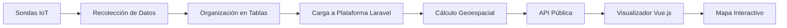

# SW-Monitor-Uniandes 💧
### Plataforma gestora de datos, indicadores y mapas de visualización sobre la calidad del agua

> **⚠️ ESTADO DEL PROYECTO:** Este repositorio se encuentra **descontinuado** y ya no está en desarrollo activo.

Una plataforma avanzada de gestión y visualización de datos ambientales desarrollada para el Proyecto de Monitoreo Ciudadano de la Universidad de los Andes, que permite gestionar y visualizar datos sobre la calidad del agua en fuentes hídricas de Colombia mediante mapas interactivos y APIs públicas.


## 🌊 Descripción del Proyecto

### Contexto: Proyecto de Monitoreo Ciudadano

El Proyecto de Monitoreo Ciudadano es una iniciativa de la Universidad de los Andes, liderada por la Facultad de Ingeniería y la Facultad de Economía, cuyo objetivo principal es recolectar datos sobre la calidad del agua en diversas fuentes hídricas de Colombia con la participación activa de las comunidades locales.

Los datos son capturados mediante **sondas especializadas** instaladas en puntos estratégicos y posteriormente organizados por los encargados del proyecto para análisis internos por investigadores y expertos en gestión del agua.

### Alcance de la Plataforma SW-Monitor

Esta plataforma se centra en crear un sistema avanzado de **gestión y visualización de datos** que ofrece:

- **📊 Gestión avanzada de datos:** Carga y almacenamiento seguro en MySQL
- **🗺️ Visualización interactiva:** Mapas dinámicos y gráficos geoespaciales
- **🔌 API pública:** Integración con otros sistemas y portales web
- **📱 Microfrontend embebible:** Visualizador integrable en cualquier sitio web

## 🏗️ Arquitectura del Sistema

La plataforma implementa una **arquitectura modular backend/frontend** con las siguientes capas:

### Backend (Laravel)
- **Gestión de datos:** Carga desde tablas organizadas y almacenamiento en MySQL
- **API RESTful:** Endpoints públicos para acceso a datos de calidad del agua
- **Cálculos geoespaciales:** Algoritmos de geofencing para determinar proximidad
- **Procesamiento de sondas:** Recepción y validación de datos de sensores

### Frontend (Vue.js)
- **Visualizador interactivo:** Mapas dinámicos con OpenStreetMap
- **Microfrontend:** Componente embebible en portales web
- **Interfaz responsiva:** Adaptable a diferentes dispositivos y resoluciones
- **Filtros geográficos:** Preselección automática por zonas específicas

### Integración de Datos
- **Sondas IoT** → **Procesamiento Laravel** → **Almacenamiento MySQL** → **Visualización Vue.js**

## 🛠️ Stack Tecnológico

| Categoría | Tecnología | Uso |
|-----------|------------|-----|
| **Backend** |  Laravel | Framework principal, API REST |
| **Frontend** |  Vue.js | Visualizador interactivo |
| **Estilos** |  SASS | Preprocesador CSS |
| **Base de datos** |  MySQL | Almacenamiento de datos |
| **Mapas** |  OpenStreetMap | Cartografía base |
| **Lenguaje** |  PHP | Lenguaje backend |

## 📡 Flujo de Datos



### Proceso Detallado

1. **🔬 Recolección:** Sondas capturan datos de calidad del agua (pH, temperatura, conductividad, oxígeno disuelto)
2. **📋 Organización:** Equipo de Monitoreo Ciudadano estructura los datos en tablas
3. **⚡ Carga:** Datos son importados a la plataforma Laravel
4. **📍 Geolocalización:** Cálculos de geofencing determinan proximidad a ciudades/regiones
5. **🌐 API:** Datos disponibles vía endpoints RESTful públicos
6. **🗺️ Visualización:** Mapas interactivos muestran información en tiempo real

## 🔍 Características Principales

### 📊 Gestión de Datos
- Importación masiva desde archivos estructurados
- Validación automática de datos de sensores
- Almacenamiento seguro con respaldos automáticos
- Historial completo de mediciones

### 🗺️ Visualización Geoespacial
- **Mapas interactivos** con OpenStreetMap
- **Pines dinámicos** representando ubicaciones de sondas
- **Información detallada** al hacer clic en cada punto
- **Filtros geográficos** por región/ciudad
- **Zoom automático** según la zona seleccionada

### 🔌 API Pública
- Endpoints RESTful para acceso a datos
- Filtrado por coordenadas y radio de búsqueda
- Respuestas en formato JSON estándar
- Documentación completa de endpoints

### 📱 Microfrontend Embebible
- Integración sencilla en cualquier portal web
- Configuración automática por ubicación
- Diseño responsivo para móviles y escritorio
- Personalización de colores y estilos

## 🌍 Ejemplo de Implementación

### Cálculo de Distancias Geoespaciales

```php
public function dataInPerimeter(float $latitude = 0, float $longitude = 0, $zoom)
{
    $latName = "latitud";
    $lonName = "longitud";
    
    // Cálculo del radio basado en el nivel de zoom
    $km = (40000/pow(2, $zoom)) * 2;
    
    // Fórmula de distancia geoespacial (Haversine)
    $sql = "6371 * acos(
        cos(radians(?)) *
        cos(radians(".$latName.")) *
        cos(radians(".$lonName.") - radians(?))
        + sin(radians(?)) *
        sin(radians(".$latName."))
    ) AS distance";
    
    $query = Registro::whereHas('transferencia', function($query){
        $query->where('estado', 1);
    })
    ->select('id', 'hg', 'region_id', 'longitud', 'latitud', 'conduct', 'ph', 'temperatura', 'od', 'created_at')
    ->selectRaw($sql, [$latitude, $longitude, $latitude])
    ->havingRaw('distance BETWEEN 0 AND '.$km)
    ->orderBy('distance', 'ASC')
    ->get();
    
    return $query;
}
```

### Respuesta del API

```json
{
  "registros": [
    {
      "id": 62,
      "longitud": -74.065282,
      "latitud": 4.603333,
      "conduct": 10.11,
      "ph": 5.24,
      "temperatura": 16,
      "od": 7.77,
      "distance": 0.4493249442694154
    }
  ],
  "message": "Retrieved successfully"
}
```

## 📊 Parámetros de Calidad del Agua

La plataforma monitorea los siguientes indicadores:

| Parámetro | Descripción | Unidad | Importancia |
|-----------|-------------|--------|-------------|
| **pH** | Nivel de acidez/alcalinidad | Escala 0-14 | Habitabilidad acuática |
| **Temperatura** | Temperatura del agua | °C | Ecosistema acuático |
| **Conductividad** | Capacidad de conducir electricidad | μS/cm | Contenido de sales |
| **Oxígeno Disuelto (OD)** | Concentración de oxígeno | mg/L | Vida acuática |

## 🚀 Casos de Uso

### 1. Portal Universidad de los Andes
- **Zona:** Bogotá y alrededores
- **Configuración:** Carga automática datos región Bogotá
- **Uso:** Investigación académica y divulgación

### 2. Portal Regional Samacá
- **Zona:** Boyacá - Samacá
- **Configuración:** Filtro automático zona rural
- **Uso:** Monitoreo comunitario local

### 3. Integración en Portales Municipales
- **Personalización:** Colores institucionales
- **Datos:** Específicos por municipio
- **Función:** Transparencia ambiental

## 📁 Estructura del Proyecto

```
SW-Monitor-Uniandes/
├── app/                    # Lógica principal Laravel
│   ├── Http/Controllers/   # Controladores API
│   ├── Models/            # Modelos de datos
│   └── Services/          # Servicios geoespaciales
├── database/              # Migraciones y schemas
│   ├── migrations/        # Estructura de BD
│   └── seeders/          # Datos de prueba
├── resources/             # Frontend Vue.js
│   ├── js/components/     # Componentes Vue
│   ├── sass/             # Estilos SCSS
│   └── views/            # Plantillas Blade
├── routes/               # Definición de rutas
│   ├── api.php          # Endpoints API
│   └── web.php          # Rutas web
├── public/              # Assets públicos
└── config/              # Configuraciones
```

## ⚙️ Instalación y Configuración

> **Nota:** Este proyecto está descontinuado, la información siguiente es solo para referencia histórica.

### Requisitos del Sistema
- **PHP** >= 7.4
- **Composer** 2.x
- **Node.js** >= 14.x
- **MySQL** >= 5.7
- **Laravel** 8.x

### Instalación

```bash
# Clonar el repositorio
git clone https://github.com/Leandro-Moreno/SW-Monitor-Uniandes.git
cd SW-Monitor-Uniandes

# Instalar dependencias PHP
composer install

# Instalar dependencias Node.js
npm install

# Configurar variables de entorno
cp .env.example .env
php artisan key:generate

# Configurar base de datos en .env
DB_DATABASE=sw_monitor
DB_USERNAME=tu_usuario
DB_PASSWORD=tu_password

# Ejecutar migraciones
php artisan migrate --seed

# Compilar assets frontend
npm run dev

# Iniciar servidor de desarrollo
php artisan serve
```

### Configuración del Visualizador

```javascript
// Integración en sitio web externo
<div id="water-monitor"></div>

<script>
const config = {
  apiUrl: 'https://tu-dominio.com/api',
  defaultLocation: {
    lat: 4.603333,
    lng: -74.065282,
    zoom: 12
  },
  theme: 'uniandes' // o 'custom'
};

new WaterMonitor('#water-monitor', config);
</script>
```

## 🔗 Enlaces y Recursos

### Documentación del Proyecto
- **📖 Caso de Estudio Completo:** [Monitoreo Ciudadano del Agua](https://leandromoreno.co/proyectos/monitoreo-ciudadano-del-agua-uniandes/)
- **🏛️ Cliente:** Facultad de Ingeniería & Facultad de Economía - Universidad de los Andes
- **👨‍💻 Desarrollador:** [Leandro Moreno](https://leandromoreno.co)

### APIs y Endpoints
```
GET /api/registros                    # Todos los registros
GET /api/registros/perimeter          # Registros por perímetro
GET /api/regiones                     # Regiones disponibles
GET /api/sondas                       # Lista de sondas activas
```

## 🏆 Impacto y Resultados

### 🎯 Logros Principales
- **✅ Automatización completa** del proceso de visualización
- **✅ API pública** para integración con múltiples portales
- **✅ Interfaz intuitiva** para usuarios no técnicos
- **✅ Escalabilidad** para nuevas zonas de monitoreo
- **✅ Contribución** a la investigación ambiental nacional

### 📈 Métricas de Adopción
- **🌍 Múltiples regiones** de Colombia cubiertas
- **🔬 Datos científicos** validados por expertos
- **👥 Participación ciudadana** en monitoreo ambiental
- **🏛️ Integración institucional** en portales oficiales

## 🚫 Estado de Descontinuación

### 📅 Información del Ciclo de Vida
- **Fecha de desarrollo:** 2021-2022
- **Estado actual:** 🔴 **Descontinuado**
- **Última actualización:** 2022
- **Código:** Disponible solo para referencia

### 🔍 Razones de Descontinuación
Este proyecto cumplió exitosamente sus objetivos de demostrar la viabilidad de una plataforma integrada de monitoreo ambiental. El código se mantiene disponible como:

- **📚 Referencia técnica** para desarrollos similares
- **🎓 Material de estudio** para implementaciones de geolocalización
- **💡 Inspiración** para proyectos de impacto social
- **🏗️ Base arquitectónica** para plataformas ambientales

## 🤝 Contribuciones y Legado

Este proyecto demostró cómo la tecnología puede facilitar la **participación ciudadana en el monitoreo ambiental**, creando un puente entre la recolección de datos científicos y su comprensión pública a través de visualizaciones accesibles.

La arquitectura modular desarrollada sirve como **referencia para futuras implementaciones** de sistemas de monitoreo ambiental con componentes embebibles y APIs públicas.

---

## 📞 Contacto y Soporte

- **💼 Portafolio:** [leandromoreno.co](https://leandromoreno.co)
- **📧 Email:** contacto@leandromoreno.co
- **🌐 Proyecto Completo:** [Caso de Estudio - Monitoreo Ciudadano](https://leandromoreno.co/proyectos/monitoreo-ciudadano-del-agua-uniandes/)

---

*Desarrollado con 💚 para la protección de las fuentes hídricas de Colombia*

## 📄 Licencia

Este proyecto está descontinuado y se proporciona únicamente con fines de referencia y estudio.
